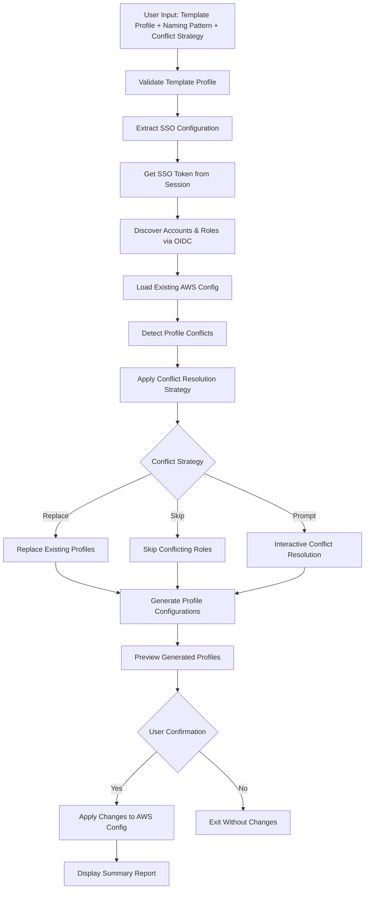

# Profile Generator Enhancement Design Document

## Overview

The profile generator enhancement extends the existing awstools profile generation feature to intelligently handle existing AWS CLI profiles. This enhancement adds the capability to detect existing profiles that correspond to discovered roles and provides users with control over how these conflicts are resolved - either by replacing existing profiles with new names based on the provided pattern, or by skipping them entirely.

This design builds upon the existing profile generator architecture in `helpers/profile_generator.go` and `helpers/aws_config_file.go`, adding new conflict detection and resolution capabilities while maintaining backward compatibility.

## Architecture

### High-Level Flow Enhancement



### Component Integration

The enhancement integrates with existing components:

- **Command Interface**: Extends `cmd/sso.go` with new flags for conflict resolution
- **Profile Generator**: Enhances `helpers/profile_generator.go` with conflict detection logic
- **AWS Config Manager**: Extends `helpers/aws_config_file.go` with profile matching capabilities
- **Output Management**: Uses existing `go-output` package for conflict reporting

## Components and Interfaces

### 1. Enhanced Command Interface (`cmd/sso.go`)

```go
func init() {
    rootCmd.AddCommand(ssoCmd)
    ssoCmd.AddCommand(profileGeneratorCmd)
    
    // Existing flags
    profileGeneratorCmd.Flags().StringP("template", "t", "", "Template profile name (required)")
    profileGeneratorCmd.Flags().StringP("pattern", "p", "{account_name}-{role_name}", "Naming pattern")
    profileGeneratorCmd.Flags().BoolP("yes", "y", false, "Auto-approve appending profiles")
    profileGeneratorCmd.Flags().StringP("output-file", "F", "", "Output to file instead of appending to config")
    
    // New enhancement flags
    profileGeneratorCmd.Flags().Bool("replace-existing", false, "Replace existing profiles with new names based on pattern")
    profileGeneratorCmd.Flags().Bool("skip-existing", false, "Skip generating profiles for roles that already have profiles")
    
    profileGeneratorCmd.MarkFlagRequired("template")
    
    // Add mutual exclusion validation for conflict resolution flags
    profileGeneratorCmd.MarkFlagsMutuallyExclusive("replace-existing", "skip-existing")
}
```

### 2. Enhanced Profile Generator (`helpers/profile_generator.go`)

```go
// ConflictResolutionStrategy defines how to handle existing profile conflicts
type ConflictResolutionStrategy int

const (
    ConflictPrompt ConflictResolutionStrategy = iota // Default: prompt user for each conflict
    ConflictReplace                                  // Replace existing profiles
    ConflictSkip                                     // Skip roles with existing profiles
)

// ProfileConflict represents a detected conflict between discovered role and existing profile
type ProfileConflict struct {
    DiscoveredRole    DiscoveredRole
    ExistingProfiles  []Profile
    ProposedName      string
    ConflictType      ConflictType
}

type ConflictType int

const (
    ConflictSameRole ConflictType = iota // Same SSO account ID and role name
    ConflictSameName                     // Same profile name but different role
)

// Enhanced ProfileGenerator struct
type ProfileGenerator struct {
    templateProfile      string
    namingPattern        string
    autoApprove          bool
    outputFile           string
    conflictStrategy     ConflictResolutionStrategy
    awsConfig            aws.Config
    ssoClient            *sso.Client
    stsClient            *sts.Client
    iamClient            *iam.Client
    roleDiscovery        *RoleDiscovery
    configFile           *AWSConfigFile
    logger               Logger
}

// NewProfileGenerator creates a new enhanced profile generator
func NewProfileGenerator(templateProfile, namingPattern string, autoApprove bool, outputFile string, 
                        conflictStrategy ConflictResolutionStrategy, awsConfig aws.Config) (*ProfileGenerator, error)

// New methods for conflict detection and resolution
func (pg *ProfileGenerator) DetectProfileConflicts(discoveredRoles []DiscoveredRole) ([]ProfileConflict, error)
func (pg *ProfileGenerator) ResolveConflicts(conflicts []ProfileConflict) ([]GeneratedProfile, []DiscoveredRole, error)
func (pg *ProfileGenerator) PromptForConflictResolution(conflict ProfileConflict) (ConflictAction, error)
func (pg *ProfileGenerator) ReplaceExistingProfile(conflict ProfileConflict) error
func (pg *ProfileGenerator) GenerateConflictReport(conflicts []ProfileConflict, actions []ConflictAction) string

// ConflictAction represents the action taken for a specific conflict
type ConflictAction struct {
    Conflict ProfileConflict
    Action   ActionType
    NewName  string
    OldName  string
}

type ActionType int

const (
    ActionReplace ActionType = iota
    ActionSkip
    ActionCreate // For new profiles without conflicts
)
```

### 3. Enhanced AWS Config File Manager (`helpers/aws_config_file.go`)

```go
// Enhanced Profile struct with conflict detection capabilities
type Profile struct {
    Name            string
    Region          string
    SSOStartURL     string
    SSORegion       string
    SSOAccountID    string
    SSORoleName     string
    SSOSession      string
    Output          string
    OtherProperties map[string]string
    
    // New fields for conflict detection
    ResolvedSSOConfig *ResolvedSSOConfig // Resolved SSO session configuration
}

// ResolvedSSOConfig represents the resolved SSO configuration for profile matching
type ResolvedSSOConfig struct {
    StartURL    string
    Region      string
    AccountID   string
    RoleName    string
}

// Enhanced AWSConfigFile with conflict detection methods
type AWSConfigFile struct {
    FilePath string
    Profiles map[string]Profile
    Sessions map[string]SSOSession // SSO session configurations
}

// SSOSession represents an SSO session configuration
type SSOSession struct {
    Name      string
    SSOStartURL string
    SSORegion   string
}

// New methods for conflict detection
func (cf *AWSConfigFile) FindProfilesForRole(accountID, roleName, startURL string) ([]Profile, error)
func (cf *AWSConfigFile) ResolveProfileSSOConfig(profile Profile) (*ResolvedSSOConfig, error)
func (cf *AWSConfigFile) RemoveProfile(profileName string) error
func (cf *AWSConfigFile) ReplaceProfile(oldName, newName string, newProfile Profile) error
func (cf *AWSConfigFile) CreateBackup() (string, error)
func (cf *AWSConfigFile) RestoreFromBackup(backupPath string) error

// Enhanced profile matching logic
func (cf *AWSConfigFile) MatchesRole(profile Profile, accountID, roleName, startURL string) (bool, error)
func (cf *AWSConfigFile) LoadSSOSessions() error
func (cf *AWSConfigFile) ResolveSSOSession(sessionName string) (*SSOSession, error)
```

### 4. Profile Conflict Detector (`helpers/profile_conflict_detector.go`)

```go
// ProfileConflictDetector handles the logic for detecting profile conflicts
type ProfileConflictDetector struct {
    configFile    *AWSConfigFile
    namingPattern *NamingPattern
    logger        Logger
}

func NewProfileConflictDetector(configFile *AWSConfigFile, namingPattern *NamingPattern) *ProfileConflictDetector

// DetectConflicts analyzes discovered roles against existing profiles
func (pcd *ProfileConflictDetector) DetectConflicts(discoveredRoles []DiscoveredRole) ([]ProfileConflict, error)

// AnalyzeRole checks a single role for conflicts
func (pcd *ProfileConflictDetector) AnalyzeRole(role DiscoveredRole) (*ProfileConflict, error)

// ClassifyConflict determines the type of conflict detected
func (pcd *ProfileConflictDetector) ClassifyConflict(existingProfiles []Profile, proposedName string, role DiscoveredRole) ConflictType

// GenerateConflictSummary creates a human-readable summary of all conflicts
func (pcd *ProfileConflictDetector) GenerateConflictSummary(conflicts []ProfileConflict) string
```

## Data Models

### Enhanced Profile Generation Result

```go
type ProfileGenerationResult struct {
    TemplateProfile       TemplateProfile
    DiscoveredRoles       []DiscoveredRole
    DetectedConflicts     []ProfileConflict
    ConflictResolutions   []ConflictAction
    GeneratedProfiles     []GeneratedProfile
    SkippedRoles          []DiscoveredRole
    ReplacedProfiles      []ProfileReplacement
    NewProfiles           []GeneratedProfile
    Errors                []error
    BackupPath            string
}

type ProfileReplacement struct {
    OldProfile Profile
    NewProfile GeneratedProfile
    OldName    string
    NewName    string
}
```

### Conflict Detection Logic

The conflict detection algorithm works as follows:

1. **Load Existing Configuration**: Parse the AWS config file and resolve all SSO sessions
2. **Role-to-Profile Matching**: For each discovered role, find existing profiles that match:
   - Same SSO start URL
   - Same account ID  
   - Same role name
3. **Name Conflict Detection**: Check if the proposed profile name already exists
4. **Conflict Classification**: Determine if conflicts are role-based or name-based
5. **Resolution Strategy Application**: Apply the user's chosen conflict resolution strategy

### Profile Matching Algorithm

```go
func (cf *AWSConfigFile) MatchesRole(profile Profile, accountID, roleName, startURL string) (bool, error) {
    // Resolve SSO configuration for the profile
    resolvedConfig, err := cf.ResolveProfileSSOConfig(profile)
    if err != nil {
        return false, err
    }
    
    // Match based on resolved SSO configuration
    return resolvedConfig.StartURL == startURL &&
           resolvedConfig.AccountID == accountID &&
           resolvedConfig.RoleName == roleName, nil
}

func (cf *AWSConfigFile) ResolveProfileSSOConfig(profile Profile) (*ResolvedSSOConfig, error) {
    // Handle legacy SSO format
    if profile.SSOStartURL != "" && profile.SSOAccountID != "" && profile.SSORoleName != "" {
        return &ResolvedSSOConfig{
            StartURL:  profile.SSOStartURL,
            Region:    profile.SSORegion,
            AccountID: profile.SSOAccountID,
            RoleName:  profile.SSORoleName,
        }, nil
    }
    
    // Handle SSO session format
    if profile.SSOSession != "" {
        session, err := cf.ResolveSSOSession(profile.SSOSession)
        if err != nil {
            return nil, err
        }
        
        return &ResolvedSSOConfig{
            StartURL:  session.SSOStartURL,
            Region:    session.SSORegion,
            AccountID: profile.SSOAccountID,
            RoleName:  profile.SSORoleName,
        }, nil
    }
    
    return nil, fmt.Errorf("profile %s does not have valid SSO configuration", profile.Name)
}
```

## Error Handling

### Enhanced Error Categories

1. **Conflict Resolution Errors**
   - Profile replacement failures
   - Backup creation failures
   - Invalid conflict resolution choices
   - **Strategy**: Rollback changes, restore from backup

2. **Configuration Parsing Errors**
   - Malformed SSO session configurations
   - Invalid profile formats
   - Missing SSO session references
   - **Strategy**: Skip problematic profiles, log warnings, continue processing

3. **File Operation Errors**
   - Config file permission issues
   - Backup/restore failures
   - Concurrent file access
   - **Strategy**: Validate permissions early, use file locking, provide recovery options

### Enhanced Error Types

```go
type ConflictResolutionError struct {
    ProfileGeneratorError
    ConflictType ConflictType
    ProfileName  string
    RoleName     string
    AccountID    string
}

func NewConflictResolutionError(message string, cause error, conflictType ConflictType) *ConflictResolutionError

type BackupError struct {
    ProfileGeneratorError
    BackupPath   string
    OriginalPath string
}

func NewBackupError(message string, cause error, backupPath, originalPath string) *BackupError
```

## Testing Strategy

### Unit Tests for New Components

1. **Profile Conflict Detection**
   - Test role-to-profile matching with legacy SSO format
   - Test role-to-profile matching with SSO session format
   - Test mixed format environments
   - Test edge cases (missing sessions, malformed profiles)

2. **Conflict Resolution Logic**
   - Test replace strategy with various conflict types
   - Test skip strategy with multiple conflicts
   - Test interactive prompt handling
   - Test conflict action recording and reporting

3. **Enhanced AWS Config File Operations**
   - Test profile replacement with backup/restore
   - Test SSO session resolution
   - Test profile removal and addition
   - Test file permission handling

### Integration Tests

1. **End-to-End Conflict Resolution**
   - Test complete workflow with existing profiles
   - Test backup and recovery scenarios
   - Test mixed conflict resolution strategies
   - Test error recovery and rollback

2. **Real-World Configuration Testing**
   - Test with actual AWS CLI configurations
   - Test with various SSO session formats
   - Test with large numbers of existing profiles
   - Test performance with complex configurations

### Test Data and Scenarios

```go
type ConflictTestScenario struct {
    Name                 string
    ExistingProfiles     []Profile
    DiscoveredRoles      []DiscoveredRole
    ConflictStrategy     ConflictResolutionStrategy
    ExpectedConflicts    []ProfileConflict
    ExpectedActions      []ConflictAction
    ExpectedNewProfiles  []GeneratedProfile
    ExpectedSkippedRoles []DiscoveredRole
}

var testScenarios = []ConflictTestScenario{
    {
        Name: "Replace existing profiles with new naming pattern",
        ExistingProfiles: []Profile{
            {Name: "old-prod-admin", SSOAccountID: "123456789012", SSORoleName: "AdministratorAccess"},
        },
        DiscoveredRoles: []DiscoveredRole{
            {AccountID: "123456789012", RoleName: "AdministratorAccess", AccountName: "production"},
        },
        ConflictStrategy: ConflictReplace,
        ExpectedActions: []ConflictAction{
            {Action: ActionReplace, OldName: "old-prod-admin", NewName: "production-AdministratorAccess"},
        },
    },
    // Additional test scenarios...
}
```

## Implementation Decisions and Rationales

### 1. Conflict Detection Strategy

**Decision**: Match profiles based on SSO configuration rather than profile names
**Rationale**: 
- Profile names can vary while pointing to the same role
- SSO configuration (start URL, account ID, role name) uniquely identifies a role
- Supports both legacy and modern SSO profile formats
- Prevents false positives from name-only matching

### 2. Conflict Resolution Options

**Decision**: Provide three strategies (replace, skip, prompt) with mutual exclusion
**Rationale**:
- Replace: Enables profile name standardization
- Skip: Preserves existing configurations
- Prompt: Provides granular control for mixed scenarios
- Mutual exclusion prevents ambiguous behavior

### 3. Backup and Recovery Strategy

**Decision**: Always create backups before modifications, with automatic rollback on errors
**Rationale**:
- Prevents data loss from failed operations
- Enables recovery from partial failures
- Builds user confidence in the tool
- Follows principle of safe operations

### 4. SSO Session Resolution

**Decision**: Support both legacy and session-based SSO formats with normalization
**Rationale**:
- Backward compatibility with older AWS CLI versions
- Forward compatibility with newer session-based format
- Consistent conflict detection regardless of format
- Simplified matching logic through normalization

### 5. Interactive Conflict Resolution

**Decision**: Use simple text-based prompts rather than complex UI
**Rationale**:
- Consistent with existing CLI tool patterns
- Works in all terminal environments
- Minimal dependencies
- Clear and straightforward user experience

## Security Considerations

1. **File Permission Preservation**: Maintain AWS config file permissions (600) during operations
2. **Backup Security**: Ensure backup files have same security permissions as originals
3. **Credential Protection**: Never log or expose SSO tokens or credentials
4. **Atomic Operations**: Use atomic file operations to prevent corruption during concurrent access
5. **Input Validation**: Sanitize all user inputs, especially profile names and patterns

## Performance Considerations

1. **Lazy Loading**: Load and parse config file only when needed
2. **Efficient Matching**: Use hash maps for O(1) profile lookups during conflict detection
3. **Batch Operations**: Group file operations to minimize I/O
4. **Memory Management**: Stream large configurations rather than loading entirely in memory
5. **Progress Reporting**: Provide feedback during long-running conflict resolution operations

## Backward Compatibility

The enhancement maintains full backward compatibility:

1. **Default Behavior**: Without new flags, behavior remains unchanged (prompts for conflicts)
2. **Existing Flags**: All existing flags continue to work as before
3. **Configuration Format**: No changes to generated profile format
4. **API Compatibility**: No breaking changes to existing helper functions
5. **Error Handling**: Enhanced error messages while maintaining error types

## Migration Path

For users upgrading to the enhanced version:

1. **No Action Required**: Existing usage patterns continue to work
2. **Gradual Adoption**: Users can adopt new flags incrementally
3. **Documentation**: Clear examples of new conflict resolution options
4. **Backward Compatibility**: Old scripts and automation continue to function
5. **Feature Discovery**: Help text and examples highlight new capabilities