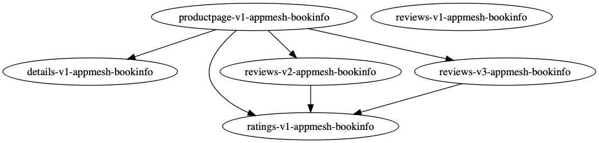
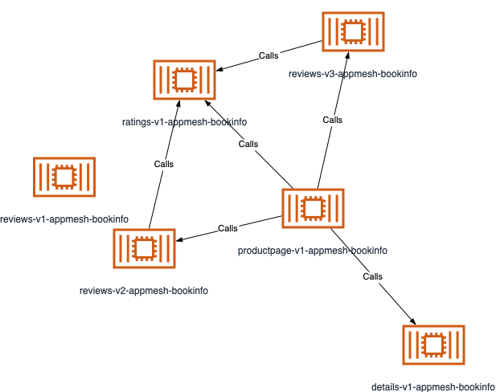
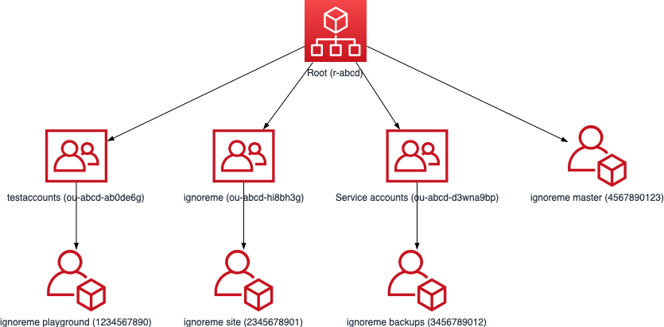
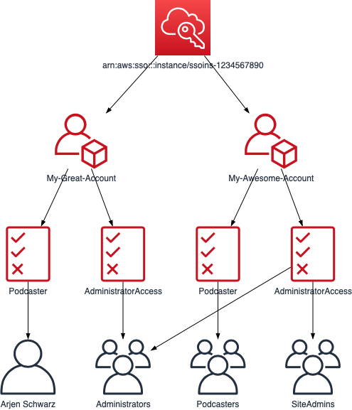

# awstools

awstools is a Go application that allows me to more easily do complex actions with AWS data. It doesn't try to replicate things that are already easy to do with the CLI, but instead focuses on more complex actions. This usually involves things that would take multiple CLI calls and a fair bit of scripting or manual work.

## Functionalities

Currently built in features:

* Get a list of all IAM users, their groups, and the policies active upon them
* Get a list of all the resources in a CloudFormation stack, including those from nested stacks
* Get an overview of the security groups in your account
* Find dangling nodes, see the routes, or get a graphical overview of your mesh from App Mesh

Run the application without any commands to get an overview, as shown below. For more details you can then run `awstools [command] --help`, which also works with subcommands such as `awstools cfn resources --help`.

```bash
$ awstools
awstools is designed to be used for more complex tasks that would take a lot of work using just the CLI.

This usually involves tasks that would require multiple calls.

Usage:
  awstools [command]

Available Commands:
  appmesh       App Mesh commands
  cfn           CloudFormation commands
  help          Help about any command
  iam           IAM commands
  names         Get the names for the resources in the account
  organizations AWS Organizations commands
  sso           Single Sign-On commands
  tgw           Transit Gateway commands
  vpc           VPC commands

Flags:
  -a, --append            Add to the provided output file instead of replacing it
  -f, --file string       Optional file to save the output to
  -h, --help              help for awstools
  -n, --namefile string   Use this file to provide names
  -o, --output string     Format for the output, currently supported are csv, json, html, dot, and drawio (default "json")
  -v, --verbose           Give verbose output

Use "awstools [command] --help" for more information about a command.
```

Output options at the moment are csv, json, dot, or drawio with json being the default so you can easily pass it to a tool like [jq](https://stedolan.github.io/jq/). Both dot and drawio are input for graphical tools and only available for certain actions. You can also directly save the output into a file. Most commands will have a verbose option that will show some additional information that you often won't need.

## Pretty names

You can generate pretty names for your outputs using a naming file, which is just a JSON file full of key:value pairs. Where possible, the key will be replaced with the value if you provide the `--namefile` option.

```bash
$ awstools vpc routes --output csv
AccountID,Account Name,ID,Name,VPC,VPC Name,Subnets,Routes
0987654321,0987654321,rtb-3456789,rtb-3456789,vpc-2345678,vpc-2345678,,"172.31.0.0/16: local,0.0.0.0/0: igw-123456"
$ awstools vpc routes --output csv --namefile test.json
AccountID,Account Name,ID,Name,VPC,VPC Name,Subnets,Routes
0987654321,Test Account,rtb-3456789,test route table,vpc-2345678,test vpc,,"172.31.0.0/16: local,0.0.0.0/0: igw-123456"
```

Creating a naming file can be done with the `names` command. This will loop over many items in your account and create the naming file with the required key-value pairs. This is currently limited both to items awstools has access to, as well as the items implemented (and what can be named).

```bash
$ awstools names --file mappings.json
```

For commands or services that cross accounts, it can be useful to append the output to an existing one.

```bash
$ awstools names --file mappings.json --append
```

### Main limitations

The main limitation currently is within SSO. Due to API limitations, it is not possible to get the pretty names of the User and Group objects automatically. However, if you have an external directory you can collect that same information there and add it to your naming file.

## Multi-account data

If you're collating data from multiple accounts (VPC peering connections for example), you can collate this for all output formats except for the dot format. This works just as for the `names` command by adding the `--append` flag in combination with the `--file` flag.

```bash
# in account 1
$ awstools vpc peerings --file peerings.json
# in account 2
$ awstools vpc peerings --file peerings.json --append
```

If you don't use the append flag, it will instead overwrite the contents of the file.

## Output formats

Where everything supports CSV, JSON, and HTML outputs, several commands also support graphical output formats. These require a little bit more work, but can be very useful to get an overview or even incorporate the output into your diagrams.

### Dot format

The dot format outputs a dot compatible file that you can then convert into an image using a tool like graphviz.

```bash
$ awstools appmesh showmesh -m bookinfo-mesh -o dot                                                                   14:15:04
digraph  {

  n5[label="details-v1-appmesh-bookinfo"];
  n2[label="productpage-v1-appmesh-bookinfo"];
  n1[label="ratings-v1-appmesh-bookinfo"];
  n3[label="reviews-v1-appmesh-bookinfo"];
  n6[label="reviews-v2-appmesh-bookinfo"];
  n4[label="reviews-v3-appmesh-bookinfo"];
  n2->n5;
  n2->n1;
  n2->n6;
  n2->n4;
  n6->n1;
  n4->n1;

}%
```

If you pipe this output graphviz you can convert it into an image like the below:

```bash
$ awstools appmesh showmesh -m bookinfo-mesh -o dot | dot -Tpng -o mesh.png && open mesh.png
```



### Draw.io format

[Draw.io](https://draw.io) is a very good free online diagramming tool. One of its advantages is that you can import diagrams from a CSV file, which is therefore one of the output formats.

```bash
$ awstools appmesh showmesh -m bookinfo-mesh -o drawio
# label: %Name%
# style: %Image%
# parentstyle: swimlane;whiteSpace=wrap;html=1;childLayout=stackLayout;horizontal=1;horizontalStack=0;resizeParent=1;resizeLast=0;collapsible=1;
# identity: -
# parent: -
# namespace: csvimport-
# connect: {"from":"Endpoints","to":"Name","invert":false,"label":"Calls","style":"curved=1;endArrow=blockThin;endFill=1;fontSize=11;"}
# left:
# top:
# width: 78
# height: 78
# padding: 0
# ignore: Image
# link: url
# nodespacing: 40
# levelspacing: 100
# edgespacing: 40
# layout: auto
## ---- CSV below this line. First line are column names. ----
Name,Endpoints,Image
ratings-v1-appmesh-bookinfo,,outlineConnect=0;fontColor=#232F3E;gradientColor=none;fillColor=#D05C17;strokeColor=none;dashed=0;verticalLabelPosition=bottom;verticalAlign=top;align=center;html=1;fontSize=12;fontStyle=0;aspect=fixed;pointerEvents=1;shape=mxgraph.aws4.container_2;
productpage-v1-appmesh-bookinfo,"details-v1-appmesh-bookinfo,ratings-v1-appmesh-bookinfo,reviews-v2-appmesh-bookinfo,reviews-v3-appmesh-bookinfo",outlineConnect=0;fontColor=#232F3E;gradientColor=none;fillColor=#D05C17;strokeColor=none;dashed=0;verticalLabelPosition=bottom;verticalAlign=top;align=center;html=1;fontSize=12;fontStyle=0;aspect=fixed;pointerEvents=1;shape=mxgraph.aws4.container_2;
reviews-v1-appmesh-bookinfo,,outlineConnect=0;fontColor=#232F3E;gradientColor=none;fillColor=#D05C17;strokeColor=none;dashed=0;verticalLabelPosition=bottom;verticalAlign=top;align=center;html=1;fontSize=12;fontStyle=0;aspect=fixed;pointerEvents=1;shape=mxgraph.aws4.container_2;
reviews-v3-appmesh-bookinfo,ratings-v1-appmesh-bookinfo,outlineConnect=0;fontColor=#232F3E;gradientColor=none;fillColor=#D05C17;strokeColor=none;dashed=0;verticalLabelPosition=bottom;verticalAlign=top;align=center;html=1;fontSize=12;fontStyle=0;aspect=fixed;pointerEvents=1;shape=mxgraph.aws4.container_2;
details-v1-appmesh-bookinfo,,outlineConnect=0;fontColor=#232F3E;gradientColor=none;fillColor=#D05C17;strokeColor=none;dashed=0;verticalLabelPosition=bottom;verticalAlign=top;align=center;html=1;fontSize=12;fontStyle=0;aspect=fixed;pointerEvents=1;shape=mxgraph.aws4.container_2;
reviews-v2-appmesh-bookinfo,ratings-v1-appmesh-bookinfo,outlineConnect=0;fontColor=#232F3E;gradientColor=none;fillColor=#D05C17;strokeColor=none;dashed=0;verticalLabelPosition=bottom;verticalAlign=top;align=center;html=1;fontSize=12;fontStyle=0;aspect=fixed;pointerEvents=1;shape=mxgraph.aws4.container_2;
```

If you copy this output and import it into your diagram (through pasting it into the field you get via Arrange -> Insert -> Advanced -> CSV) that results in a diagram like the below.



You can get a similar output for your organizations structure with:

```bash
$ awstools organizations structure -o drawio
```



Or your SSO output with

```bash
$ awstools sso by-account -o drawio
```



## Installation and configuration

Simply download the [latest release][latest] for your platform, and you can use it. You can place it somewhere in your $PATH to ensure you can run it from anywhere.

The AWS configuration is read from the standard locations:

* Your environment variables (`AWS_ACCESS_KEY`, `AWS_SECRET_ACCESS_KEY`, etc.).
* The values in your `~/.aws/credentials` file.
* Permissions from the IAM role the application has access to (when running on AWS)

Unfortunately, the Go SDK doesn't support the credentials used by the AWS CLI v2 for AWS SSO connections. If you wish to use this, you will need to export the current settings (for an example see the `awsexportcurrent` function in [this zsh config file](https://github.com/ArjenSchwarz/custom_zsh/blob/master/plugins/aws-shorts/aws-shorts.plugin.zsh)) or use a tool like [benkehoe/aws-sso-credential-process](https://github.com/benkehoe/aws-sso-credential-process).

[latest]: https://github.com/ArjenSchwarz/awstools/releases

## Shell completion

Shell (tab) completion is available for bash, zsh, fish, and Powershell. You can do so with the [awstools gen completion](docs/awstools_gen_completion.md) command.

```shell
$ awstools
appmesh        -- App Mesh commands
cfn            -- CloudFormation commands
gen            -- Generate various useful things for awstools
help           -- Help about any command
iam            -- IAM commands
names          -- Get the names for the resources in the account
organizations  -- AWS Organizations commands
sso            -- Single Sign-On commands
tgw            -- Transit Gateway commands
vpc            -- VPC commands
```

## Documentation

Full documentation is available using the `--help` flag, but is also automatically generated and [can be found in the docs](docs/awstools.md).

## Development

awstools uses the Cobra framework for ease of development. While I will usually only build the functionalities that I need at a certain time, feel free to request or add features.

If you wish to contribute you can always create Issues or Pull Requests. For Pull Request, just follow the standard pattern.

1. Fork the repository
2. Make your changes
3. Make a pull request that explains what it does
