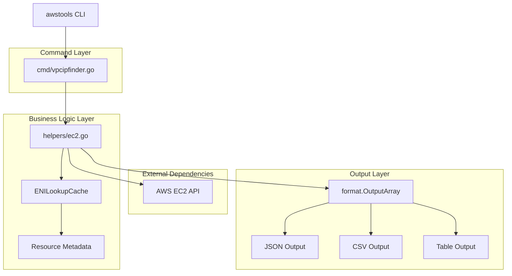
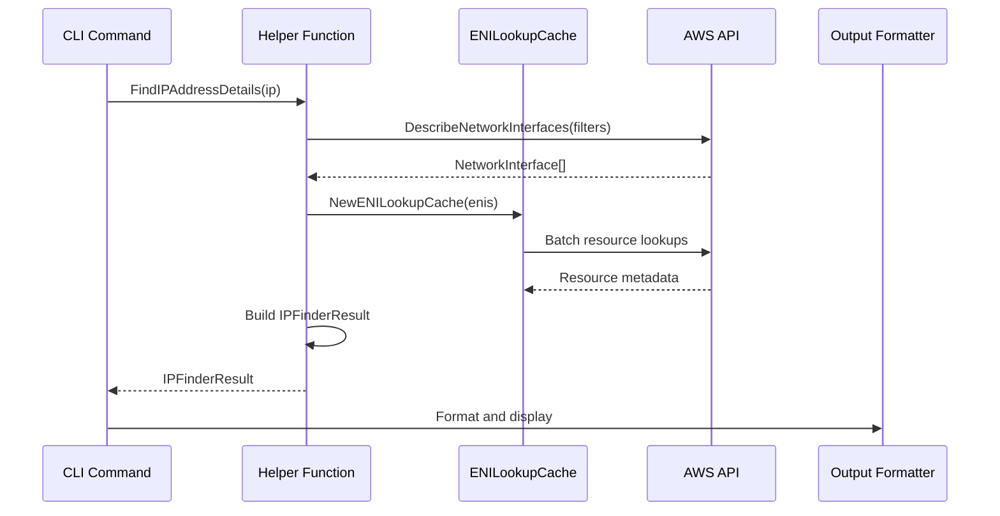

# IP Usage Finder Design Document

## Overview

The IP Usage Finder is a new command-line feature for the awstools CLI that enables users to search for IP addresses within their AWS infrastructure and identify the associated Elastic Network Interface (ENI) and connected AWS resources. This feature addresses the common operational challenge of quickly identifying which AWS resource owns a specific IP address, enabling faster troubleshooting and network analysis.

The feature will integrate seamlessly with the existing awstools architecture, following established patterns for command structure, AWS SDK integration, output formatting, and error handling. It will leverage the existing ENI caching mechanisms to ensure optimal performance when analyzing multiple resources.

## Architecture

The IP Usage Finder follows the established awstools architecture pattern with clear separation of concerns:



### Design Rationale

1. **Consistency**: Follows existing command patterns in awstools for predictable user experience
2. **Performance**: Leverages existing ENILookupCache to minimize API calls and avoid rate limiting
3. **Extensibility**: Designed to easily support additional IP-related search scenarios
4. **Error Handling**: Adheres to established error handling patterns in the codebase
5. **Output Flexibility**: Supports all existing output formats for integration with other tools

## Components and Interfaces

### Command Component

**File**: `cmd/vpcipfinder.go`

```go
// Command structure following established patterns
var ipFinderCmd = &cobra.Command{
    Use:   "ip-finder [IP_ADDRESS]",
    Short: "Find ENI and resource details for an IP address",
    Long:  `Search for an IP address across ENIs and return detailed information about the associated resources`,
    Args:  cobra.ExactArgs(1),
    Run:   findIPAddress,
}

// Global variables for flags
var (
    searchAllRegions bool
)

// Command handler function
func findIPAddress(cmd *cobra.Command, args []string) {
    ipAddress := args[0]
    
    // Validate IP address format
    if !isValidIPAddress(ipAddress) {
        panic(fmt.Errorf("invalid IP address format: %s", ipAddress))
    }
    
    // Load AWS configuration
    awsConfig := config.DefaultAwsConfig(*settings)
    
    // Call helper function
    result := helpers.FindIPAddressDetails(awsConfig.Ec2Client(), ipAddress)
    
    // Format and output results
    formatIPFinderOutput(result)
}
```

### Helper Component

**File**: `helpers/ec2.go` (extending existing file)

```go
// Data structures for IP search results
type IPFinderResult struct {
    IPAddress        string
    ENI              *types.NetworkInterface
    ResourceType     string
    ResourceName     string
    ResourceID       string
    VPC              VPCInfo
    Subnet           SubnetInfo
    SecurityGroups   []SecurityGroupInfo
    IsSecondaryIP    bool
    Found            bool
}

type VPCInfo struct {
    ID   string
    Name string
    CIDR string
}

type SubnetInfo struct {
    ID   string
    Name string
    CIDR string
}

type SecurityGroupInfo struct {
    ID   string
    Name string
}

// Main search function
func FindIPAddressDetails(svc *ec2.Client, ipAddress string) IPFinderResult {
    // Create filter for IP address search
    filters := []types.Filter{
        {
            Name:   aws.String("addresses.private-ip-address"),
            Values: []string{ipAddress},
        },
    }
    
    // Search for ENIs with the IP address
    enis := searchENIsByIP(svc, filters)
    
    if len(enis) == 0 {
        return IPFinderResult{
            IPAddress: ipAddress,
            Found:     false,
        }
    }
    
    // Process the first matching ENI
    eni := enis[0]
    
    // Create ENI cache for efficient resource lookup
    cache := NewENILookupCache(svc, []types.NetworkInterface{eni})
    
    // Build detailed result
    result := IPFinderResult{
        IPAddress:      ipAddress,
        ENI:           &eni,
        Found:         true,
        IsSecondaryIP: isSecondaryIP(eni, ipAddress),
    }
    
    // Populate resource information
    result.ResourceType, result.ResourceName, result.ResourceID = getResourceDetails(eni, cache)
    result.VPC = getVPCInfo(svc, aws.ToString(eni.VpcId))
    result.Subnet = getSubnetInfo(svc, aws.ToString(eni.SubnetId))
    result.SecurityGroups = getSecurityGroupInfo(svc, eni.Groups)
    
    return result
}

// Helper functions
func searchENIsByIP(svc *ec2.Client, filters []types.Filter) []types.NetworkInterface {
    input := &ec2.DescribeNetworkInterfacesInput{
        Filters: filters,
    }
    
    resp, err := svc.DescribeNetworkInterfaces(context.TODO(), input)
    if err != nil {
        panic(err)
    }
    
    return resp.NetworkInterfaces
}

func isSecondaryIP(eni types.NetworkInterface, ipAddress string) bool {
    primaryIP := aws.ToString(eni.PrivateIpAddress)
    if primaryIP == ipAddress {
        return false
    }
    
    for _, privateIP := range eni.PrivateIpAddresses {
        if aws.ToString(privateIP.PrivateIpAddress) == ipAddress && !aws.ToBool(privateIP.Primary) {
            return true
        }
    }
    
    return false
}

func getResourceDetails(eni types.NetworkInterface, cache *ENILookupCache) (string, string, string) {
    // Leverage existing ENI analysis functions
    resourceType := getENIUsageTypeOptimized(eni, cache)
    attachmentDetails := getENIAttachmentDetailsOptimized(eni, cache)
    
    return resourceType, attachmentDetails.Name, attachmentDetails.ID
}
```

### Validation Component

```go
// IP address validation functions
func isValidIPAddress(ip string) bool {
    return net.ParseIP(ip) != nil
}

func isValidCIDR(cidr string) bool {
    _, _, err := net.ParseCIDR(cidr)
    return err == nil
}
```

### Output Component

The output component leverages the existing `format.OutputArray` system with IP-specific formatting:

```go
func formatIPFinderOutput(result IPFinderResult) {
    if !result.Found {
        fmt.Printf("IP address %s not found in any ENI\n", result.IPAddress)
        return
    }
    
    keys := []string{"Field", "Value"}
    output := format.OutputArray{
        Keys:     keys,
        Settings: settings.NewOutputSettings(),
    }
    
    output.Settings.Title = fmt.Sprintf("IP Address Details: %s", result.IPAddress)
    
    // Add result data
    outputData := []map[string]interface{}{
        {"Field": "IP Address", "Value": result.IPAddress},
        {"Field": "ENI ID", "Value": aws.ToString(result.ENI.NetworkInterfaceId)},
        {"Field": "Resource Type", "Value": result.ResourceType},
        {"Field": "Resource Name", "Value": result.ResourceName},
        {"Field": "Resource ID", "Value": result.ResourceID},
        {"Field": "VPC", "Value": fmt.Sprintf("%s (%s)", result.VPC.Name, result.VPC.ID)},
        {"Field": "Subnet", "Value": fmt.Sprintf("%s (%s)", result.Subnet.Name, result.Subnet.ID)},
        {"Field": "Is Secondary IP", "Value": result.IsSecondaryIP},
    }
    
    for _, data := range outputData {
        holder := format.OutputHolder{Contents: data}
        output.AddHolder(holder)
    }
    
    output.Write()
}
```

## Data Models

### Core Data Structures

```go
// Primary result structure
type IPFinderResult struct {
    IPAddress        string                    `json:"ip_address"`
    ENI              *types.NetworkInterface   `json:"eni,omitempty"`
    ResourceType     string                    `json:"resource_type"`
    ResourceName     string                    `json:"resource_name"`
    ResourceID       string                    `json:"resource_id"`
    VPC              VPCInfo                   `json:"vpc"`
    Subnet           SubnetInfo                `json:"subnet"`
    SecurityGroups   []SecurityGroupInfo       `json:"security_groups"`
    IsSecondaryIP    bool                      `json:"is_secondary_ip"`
    Found            bool                      `json:"found"`
}

// Supporting structures
type VPCInfo struct {
    ID   string `json:"id"`
    Name string `json:"name"`
    CIDR string `json:"cidr"`
}

type SubnetInfo struct {
    ID   string `json:"id"`
    Name string `json:"name"`
    CIDR string `json:"cidr"`
}

type SecurityGroupInfo struct {
    ID   string `json:"id"`
    Name string `json:"name"`
}
```

### AWS SDK Integration

The data models integrate with existing AWS SDK v2 types:

- `types.NetworkInterface`: Core ENI data from AWS API
- `types.Filter`: Used for IP address filtering
- `types.NetworkInterfacePrivateIpAddress`: IP address details
- `types.GroupIdentifier`: Security group information

### Data Flow



## Error Handling

The error handling strategy aligns with established awstools patterns:

### Error Categories

1. **Input Validation Errors**: Invalid IP address format
2. **AWS API Errors**: Authentication, authorization, rate limiting
3. **Resource Not Found**: IP address not found in any ENI
4. **Network Errors**: Connectivity issues to AWS API

### Error Handling Implementation

```go
// Input validation
func validateIPAddress(ip string) error {
    if net.ParseIP(ip) == nil {
        return fmt.Errorf("invalid IP address format: %s", ip)
    }
    return nil
}

// AWS API error handling (following existing patterns)
func searchENIsByIP(svc *ec2.Client, filters []types.Filter) []types.NetworkInterface {
    input := &ec2.DescribeNetworkInterfacesInput{
        Filters: filters,
    }
    
    resp, err := svc.DescribeNetworkInterfaces(context.TODO(), input)
    if err != nil {
        // Following existing awstools pattern
        panic(err)
    }
    
    return resp.NetworkInterfaces
}

// Graceful handling of missing resources
func getResourceDisplayName(resourceID string) string {
    if resourceID == "" {
        return "Unknown"
    }
    
    // Attempt name lookup with fallback
    name := getName(resourceID)
    if name == "" {
        return resourceID
    }
    
    return fmt.Sprintf("%s (%s)", name, resourceID)
}
```

### Error Messages

- **Invalid IP**: "Invalid IP address format: [IP]"
- **Not Found**: "IP address [IP] not found in any ENI"
- **AWS Error**: AWS SDK error messages passed through
- **Permission Error**: "Insufficient permissions to describe network interfaces"

## Testing Strategy

### Unit Testing

```go
// Test IP address validation
func TestValidateIPAddress(t *testing.T) {
    tests := []struct {
        name     string
        ip       string
        expected bool
    }{
        {"Valid IPv4", "192.168.1.1", true},
        {"Valid IPv6", "2001:db8::1", true},
        {"Invalid IP", "999.999.999.999", false},
        {"Empty string", "", false},
        {"Text string", "not-an-ip", false},
    }
    
    for _, tt := range tests {
        t.Run(tt.name, func(t *testing.T) {
            err := validateIPAddress(tt.ip)
            if tt.expected && err != nil {
                t.Errorf("Expected valid IP, got error: %v", err)
            }
            if !tt.expected && err == nil {
                t.Errorf("Expected error for invalid IP, got none")
            }
        })
    }
}

// Test ENI search functionality
func TestSearchENIsByIP(t *testing.T) {
    tests := []struct {
        name          string
        ip            string
        mockResponse  []types.NetworkInterface
        expectedCount int
    }{
        {
            name: "IP found in ENI",
            ip:   "10.0.1.100",
            mockResponse: []types.NetworkInterface{
                {
                    NetworkInterfaceId: aws.String("eni-12345"),
                    PrivateIpAddress:   aws.String("10.0.1.100"),
                },
            },
            expectedCount: 1,
        },
        {
            name:          "IP not found",
            ip:            "10.0.1.200",
            mockResponse:  []types.NetworkInterface{},
            expectedCount: 0,
        },
    }
    
    for _, tt := range tests {
        t.Run(tt.name, func(t *testing.T) {
            // Mock AWS client and test searchENIsByIP
            // Implementation would use AWS SDK v2 testing patterns
        })
    }
}
```

### Integration Testing

```go
// Integration test with real AWS resources
func TestIPFinderIntegration(t *testing.T) {
    if testing.Short() {
        t.Skip("Skipping integration test")
    }
    
    // Test with real AWS client
    awsConfig := config.DefaultAwsConfig(config.Config{})
    ec2Client := awsConfig.Ec2Client()
    
    // Test known IP address (would need to be set up in test environment)
    result := FindIPAddressDetails(ec2Client, "10.0.1.100")
    
    // Validate result structure
    assert.NotEmpty(t, result.IPAddress)
    if result.Found {
        assert.NotNil(t, result.ENI)
        assert.NotEmpty(t, result.ResourceType)
    }
}
```

### Performance Testing

```go
// Test performance with large numbers of ENIs
func BenchmarkIPFinder(b *testing.B) {
    // Create mock ENIs
    enis := make([]types.NetworkInterface, 1000)
    for i := 0; i < 1000; i++ {
        enis[i] = types.NetworkInterface{
            NetworkInterfaceId: aws.String(fmt.Sprintf("eni-%d", i)),
            PrivateIpAddress:   aws.String(fmt.Sprintf("10.0.%d.%d", i/255, i%255)),
        }
    }
    
    b.ResetTimer()
    for i := 0; i < b.N; i++ {
        // Test search performance
        searchENIsByIP(mockClient, []types.Filter{
            {
                Name:   aws.String("addresses.private-ip-address"),
                Values: []string{"10.0.1.100"},
            },
        })
    }
}
```

### Command-Line Testing

```bash
# Test valid IP address
awstools vpc ip-finder 10.0.1.100

# Test invalid IP address
awstools vpc ip-finder 999.999.999.999

# Test with output formats
awstools vpc ip-finder 10.0.1.100 --output json
awstools vpc ip-finder 10.0.1.100 --output csv
awstools vpc ip-finder 10.0.1.100 --output table

# Test with flags
awstools vpc ip-finder 10.0.1.100 --region us-west-2
awstools vpc ip-finder 10.0.1.100 --profile production
```

### Test Coverage Requirements

- **Unit Tests**: 90% coverage for helper functions
- **Integration Tests**: Core functionality with real AWS resources
- **Error Handling**: All error paths tested
- **Performance**: Benchmark tests for large-scale searches
- **CLI Tests**: Command-line interface validation

The testing strategy ensures robust functionality while maintaining compatibility with existing awstools patterns and AWS SDK v2 integration.