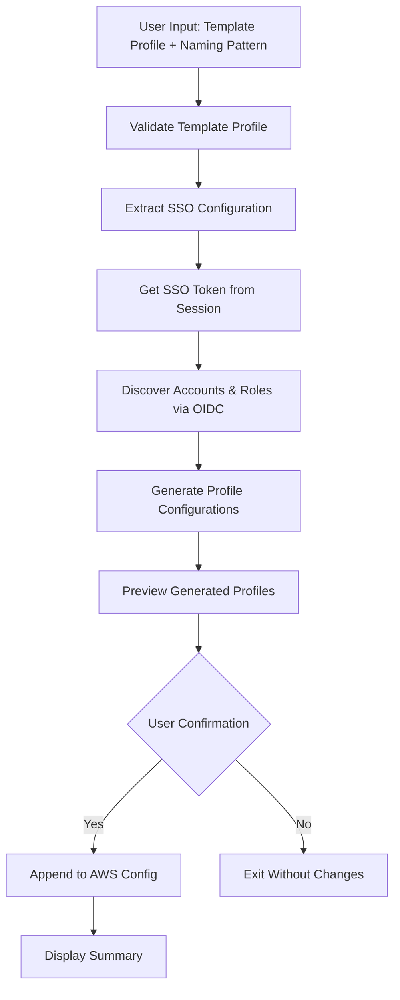

# Profile Generator Design Document

## Overview

The profile-generator feature extends the existing awstools CLI to automatically generate AWS CLI profiles for all assumable roles in AWS IAM Identity Center. By leveraging an existing SSO profile as a template, the tool discovers all accessible accounts and permission sets, then generates corresponding AWS CLI profiles using a configurable naming pattern.

This design builds upon the existing SSO functionality in the codebase and integrates seamlessly with the current architecture using the Cobra CLI framework and AWS SDK v2.

## Architecture

### High-Level Flow



### Component Integration

The profile-generator integrates with existing awstools components:

- **Command Structure**: Extends the existing SSO command group (`cmd/sso.go`)
- **AWS Configuration**: Uses existing `config/awsconfig.go` patterns for AWS client initialization
- **SSO Integration**: Leverages existing `helpers/sso.go` structures and patterns
- **Output Management**: Uses existing `go-output` package for consistent formatting

## Components and Interfaces

### 1. Command Interface (`cmd/sso.go`)

```go
var profileGeneratorCmd = &cobra.Command{
    Use:   "profile-generator",
    Short: "Generate AWS CLI profiles for all assumable roles",
    Long:  `Generate AWS CLI profiles for all assumable roles in AWS IAM Identity Center`,
    Run:   profileGenerator,
}

func init() {
    ssoCmd.AddCommand(profileGeneratorCmd)
    profileGeneratorCmd.Flags().StringP("template", "t", "", "Template profile name (required)")
    profileGeneratorCmd.Flags().StringP("pattern", "p", "{account_name}-{role_name}", "Naming pattern")
    profileGeneratorCmd.Flags().BoolP("yes", "y", false, "Auto-approve appending profiles")
    profileGeneratorCmd.Flags().StringP("output-file", "o", "", "Output to file instead of appending to config")
    profileGeneratorCmd.MarkFlagRequired("template")
}
```

### 2. Profile Generator Core (`helpers/profile_generator.go`)

```go
type ProfileGenerator struct {
    templateProfile string
    namingPattern   string
    autoApprove     bool
    outputFile      string
    awsConfig       aws.Config
    ssoClient       *sso.Client
    stsClient       *sts.Client
    logger          *log.Logger
}

type GeneratedProfile struct {
    Name         string
    AccountID    string
    AccountName  string
    RoleName     string
    Region       string
    SSOStartURL  string
    SSORegion    string
    SSOSession   string
}

func NewProfileGenerator(template, pattern string, autoApprove bool, outputFile string) *ProfileGenerator
func (pg *ProfileGenerator) ValidateTemplateProfile() error
func (pg *ProfileGenerator) DiscoverRoles() ([]GeneratedProfile, error)
func (pg *ProfileGenerator) GenerateProfiles(roles []DiscoveredRole) ([]GeneratedProfile, error)
func (pg *ProfileGenerator) PreviewProfiles(profiles []GeneratedProfile) error
func (pg *ProfileGenerator) AppendToConfig(profiles []GeneratedProfile) error
```

### 3. AWS Config File Manager (`helpers/aws_config_file.go`)

```go
type AWSConfigFile struct {
    FilePath string
    Profiles map[string]Profile
}

type Profile struct {
    Region       string
    SSOStartURL  string
    SSORegion    string
    SSOAccountID string
    SSORoleName  string
    SSOSession   string
}

func LoadAWSConfigFile(filePath string) (*AWSConfigFile, error)
func (cf *AWSConfigFile) GetProfile(name string) (Profile, bool)
func (cf *AWSConfigFile) AddProfile(name string, profile Profile) error
func (cf *AWSConfigFile) WriteToFile() error
func (cf *AWSConfigFile) GenerateProfileText(profiles []GeneratedProfile) string
```

### 4. Role Discovery Engine (`helpers/role_discovery.go`)

The Role Discovery Engine uses the OIDC token approach to discover accessible roles without requiring Admin API access. It works by:

1. **Token Discovery**: Uses the existing SSO session's cached tokens from `~/.aws/sso/cache/`
2. **Account Enumeration**: Calls the SSO Portal API to list all accounts accessible to the user
3. **Role Discovery**: For each account, uses STS GetCallerIdentity to discover assumable roles
4. **Metadata Retrieval**: Fetches account names and role information for profile generation

```go
type RoleDiscovery struct {
    ssoClient     *sso.Client
    stsClient     *sts.Client
    ssoStartURL   string
    ssoRegion     string
    ssoSession    string
    logger        *log.Logger
}

type DiscoveredRole struct {
    AccountID          string
    AccountName        string
    PermissionSetName  string
    RoleName          string  // SSO role name in account
}

func NewRoleDiscovery(ssoClient *sso.Client, stsClient *sts.Client, ssoStartURL, ssoRegion, ssoSession string) *RoleDiscovery
func (rd *RoleDiscovery) DiscoverAccessibleRoles() ([]DiscoveredRole, error)
func (rd *RoleDiscovery) GetAccountInfo(accountID string) (string, error)
func (rd *RoleDiscovery) GetAccountsFromToken() ([]string, error)
func (rd *RoleDiscovery) GetRolesForAccount(accountID string) ([]string, error)
func (rd *RoleDiscovery) LoadCachedToken() (string, error)
func (rd *RoleDiscovery) RefreshTokenIfNeeded() error
```

## Data Models

### Template Profile Configuration

```go
type TemplateProfile struct {
    Name         string
    Region       string
    SSOStartURL  string
    SSORegion    string
    SSOSession   string
    IsSSO        bool
    IsValid      bool
}
```

### Naming Pattern Variables

Supported placeholder variables in naming patterns:
- `{account_id}` - AWS account ID (e.g., "123456789012")
- `{account_name}` - Account alias or name (e.g., "production")
- `{role_name}` - Permission set/role name (e.g., "PowerUserAccess")
- `{region}` - AWS region (e.g., "us-east-1")

Pattern examples:
- `{account_name}-{role_name}` → "production-PowerUserAccess"
- `{account_id}-{role_name}` → "123456789012-PowerUserAccess"
- `sso-{account_name}-{role_name}` → "sso-production-PowerUserAccess"

### Profile Generation Output

```go
type ProfileGenerationResult struct {
    TemplateProfile    TemplateProfile
    DiscoveredRoles    []DiscoveredRole
    GeneratedProfiles  []GeneratedProfile
    ConflictingProfiles []string
    SuccessfulProfiles  []string
    Errors             []error
}
```

## Error Handling

### Error Categories and Handling Strategy

1. **Configuration Errors**
   - Template profile not found
   - Invalid naming pattern
   - AWS config file permissions
   - **Strategy**: Validate early, provide clear error messages with suggestions

2. **Authentication Errors**
   - SSO token expired
   - Invalid OIDC token
   - Token refresh failures
   - Insufficient permissions
   - **Strategy**: Detect auth issues, provide re-authentication guidance with aws sso login

3. **API Errors**
   - Network connectivity issues
   - AWS service throttling
   - Account access denied
   - **Strategy**: Implement retry logic, graceful degradation

4. **File Operation Errors**
   - Config file read-only
   - Disk space issues
   - File corruption
   - **Strategy**: Validate file permissions before operations, provide recovery options

### Error Handling Implementation

```go
type ProfileGeneratorError struct {
    Type    ErrorType
    Message string
    Cause   error
    Context map[string]interface{}
}

type ErrorType int

const (
    ErrorTypeValidation ErrorType = iota
    ErrorTypeAuth
    ErrorTypeAPI
    ErrorTypeFileSystem
    ErrorTypeNetwork
)

func (e ProfileGeneratorError) Error() string
func (e ProfileGeneratorError) Unwrap() error
func (e ProfileGeneratorError) WithContext(key string, value interface{}) ProfileGeneratorError
```

## Testing Strategy

### Unit Tests

1. **Template Profile Validation**
   - Valid SSO profile parsing
   - Invalid profile rejection
   - Missing profile handling
   - Legacy vs. new format support

2. **Naming Pattern Processing**
   - Variable substitution
   - Invalid pattern detection
   - Conflict resolution
   - Special character handling

3. **Role Discovery**
   - Mock SSO OIDC API responses
   - Account role enumeration via STS
   - Account information retrieval
   - Token refresh handling
   - Error condition handling

4. **Profile Generation**
   - Template to profile conversion
   - Multiple account/role scenarios
   - Naming conflicts resolution
   - Empty result handling

### Integration Tests

1. **End-to-End Profile Generation**
   - Complete workflow with real AWS SSO OIDC tokens
   - File operations and permissions
   - Interactive confirmation flows
   - Token refresh scenarios
   - Error recovery scenarios

2. **AWS Config File Operations**
   - Reading existing configurations
   - Appending new profiles
   - Preserving existing content
   - Backup and recovery

### Test Data and Mocking

```go
// Test fixtures for consistent testing
type TestFixtures struct {
    ValidSSOProfile     string
    InvalidProfile      string
    MockSSOAccounts     []SSOAccount
    MockSSOTokens       []SSOToken
    MockAccountRoles    map[string][]string
    ExpectedProfiles    []GeneratedProfile
}
```

## Implementation Decisions and Rationales

### 1. SSO Admin API vs. OIDC Token Approach

**Decision**: Use OIDC Token Approach (more accessible)
**Rationale**: 
- Works for users without Admin API access
- Uses existing SSO session tokens from AWS CLI
- Discovers roles through account enumeration with STS assume role
- More universally accessible in enterprise environments
- Follows principle of least privilege

### 2. Profile Format Support

**Decision**: Support both legacy and new SSO session format
**Rationale**:
- Backward compatibility with existing installations
- Template profiles may use either format
- Generated profiles will use the same format as template

### 3. Interactive vs. Non-Interactive Mode

**Decision**: Default to interactive with `--yes` flag override
**Rationale**:
- Prevents accidental config file modification
- Provides user control over profile additions
- Supports automation needs with flag override

### 4. Error Handling Strategy

**Decision**: Return errors instead of panic (improvement over existing code)
**Rationale**:
- Follows Go best practices
- Aligns with CLAUDE.md guidelines
- Provides better user experience
- Enables proper error recovery

### 5. Configuration File Management

**Decision**: Direct modification of `~/.aws/config` with backup
**Rationale**:
- Seamless integration with existing AWS CLI usage
- Automatic backup prevents data loss
- User can review changes before applying
- Supports alternative output file option

## Security Considerations

1. **Credential Security**: Never log or expose AWS credentials or tokens
2. **File Permissions**: Ensure AWS config files maintain proper permissions (600)
3. **Input Validation**: Sanitize all user inputs, especially naming patterns
4. **Backup Strategy**: Create backups before modifying configuration files
5. **Token Handling**: Respect OIDC token expiration and refresh requirements, guide users to run `aws sso login` when tokens expire

## Performance Considerations

1. **API Rate Limiting**: Implement exponential backoff for AWS API calls
2. **Concurrent Processing**: Use goroutines for parallel account/role discovery
3. **Memory Management**: Stream large result sets rather than loading all in memory
4. **Caching**: Cache account information to reduce redundant API calls
5. **Progress Indication**: Provide progress feedback for long-running operations